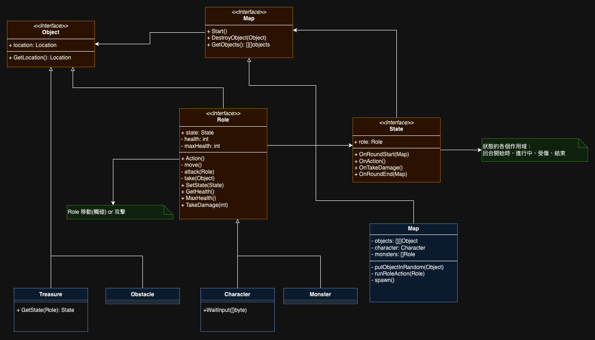

# State - 2D Map Adventure Game

## Run
```shell
go run ./cmd/main.go
```

## Build Executable
```shell
docker container run --rm  --entrypoint='' \
  --platform linux/amd64 \
  -v .:/app \
  -w /app \
  golang:1.23-alpine /bin/sh -c 'env GOOS=darwin GOARCH=arm64 go build -o /app/build/start /app/cmd/main.go'
```
and run
```shell
./build/start
```

## OOD

